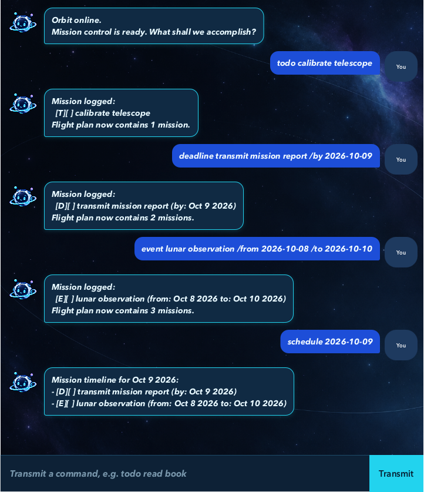

# Orbit User Guide

Orbit is a desktop task manager with a calm mission-control personality. It is optimized for fast keyboard commands while retaining a graphical chat interface. Orbit helps you record todos, deadlines, and multi-day events, then search or review them by date.

- [Quick start](#quick-start)
- [Features](#features)
  - [Adding a todo: `todo`](#adding-a-todo-todo)
  - [Adding a deadline: `deadline`](#adding-a-deadline-deadline)
  - [Adding an event: `event`](#adding-an-event-event)
  - [Listing all tasks: `list`](#listing-all-tasks-list)
  - [Marking a task as done: `mark`](#marking-a-task-as-done-mark)
  - [Marking a task as not done: `unmark`](#marking-a-task-as-not-done-unmark)
  - [Deleting a task: `delete`](#deleting-a-task-delete)
  - [Finding tasks: `find`](#finding-tasks-find)
  - [Viewing a date's schedule: `schedule`](#viewing-a-dates-schedule-schedule)
  - [Exiting Orbit: `bye`](#exiting-orbit-bye)
  - [Saving data](#saving-data)
- [FAQ](#faq)
- [Known limitations](#known-limitations)
- [Command summary](#command-summary)

## Quick start

1. Install **Java 25** on your computer.
2. Download `orbit.jar` from the [latest GitHub release](https://github.com/Zhikai-Koh/ip/releases/latest).
3. Put `orbit.jar` in the folder that you want Orbit to use as its home folder.
4. Open a terminal in that folder and run:

   ```bash
   java -jar orbit.jar
   ```

5. The Orbit window should appear:

   

6. Type a command in the command box and press **Enter**, or select **Transmit**.

   Some commands to try:

   ```text
   todo calibrate telescope
   deadline transmit mission report /by 2026-10-09
   event lunar observation /from 2026-10-08 /to 2026-10-10
   list
   schedule 2026-10-09
   ```

7. See [Features](#features) for the full command reference.

Developers can alternatively run Orbit from the project root with `./gradlew run`.

## Features

### Command format

The command descriptions below use these conventions:

- Words in `UPPER_CASE` are values that you supply. For example, replace `DESCRIPTION` with `calibrate telescope`.
- All parameters are required unless the guide explicitly says otherwise.
- Commands, prefixes, and descriptions are case-sensitive. For example, `todo` is valid but `Todo` is not.
- Dates must use `yyyy-MM-dd`. For example, `2026-10-09` means 9 October 2026.
- Enter commands on one line. Leading and trailing spaces are ignored.
- Commands without arguments (`list` and `bye`) must be entered exactly as shown.
- A task description cannot contain the reserved separator ` | ` (a pipe with one space on each side).

### Adding a todo: `todo`

Adds a task that has no date.

Format: `todo DESCRIPTION`

Example:

```text
todo calibrate telescope
```

Orbit adds the task to the end of the flight plan. New tasks are not done and display the status `[ ]`.

### Adding a deadline: `deadline`

Adds a task that must be completed by a date.

Format: `deadline DESCRIPTION /by DATE`

Example:

```text
deadline transmit mission report /by 2026-10-09
```

The `/by` prefix separates the description from its deadline. The date must be a real calendar date in `yyyy-MM-dd` format.

### Adding an event: `event`

Adds a task that takes place over an inclusive date range.

Format: `event DESCRIPTION /from START_DATE /to END_DATE`

Example:

```text
event lunar observation /from 2026-10-08 /to 2026-10-10
```

- `/from` gives the first day of the event.
- `/to` gives the last day of the event.
- `END_DATE` must be the same as or later than `START_DATE`.
- A one-day event uses the same date for `/from` and `/to`.

### Listing all tasks: `list`

Shows every task in the flight plan with its current task number.

Format: `list`

Example output:

```text
1.[T][ ] calibrate telescope
2.[D][ ] transmit mission report (by: Oct 9 2026)
3.[E][ ] lunar observation (from: Oct 8 2026 to: Oct 10 2026)
```

Task symbols:

| Symbol | Meaning |
|---|---|
| `[T]` | Todo |
| `[D]` | Deadline |
| `[E]` | Event |
| `[ ]` | Not done |
| `[X]` | Done |

Use the task numbers shown by `list` with `mark`, `unmark`, and `delete`. Task numbers can change after deletion, so run `list` again before another numbered command.

### Marking a task as done: `mark`

Marks the specified task as completed.

Format: `mark TASK_NUMBER`

Example:

```text
mark 1
```

`TASK_NUMBER` must be a positive whole number currently shown by `list`.

### Marking a task as not done: `unmark`

Returns the specified task to the not-done state.

Format: `unmark TASK_NUMBER`

Example:

```text
unmark 1
```

### Deleting a task: `delete`

Permanently removes the specified task from the flight plan.

Format: `delete TASK_NUMBER`

Example:

```text
delete 2
```

Run `list` first and use the task number shown there. Orbit displays the removed task so that you can verify the result.

### Finding tasks: `find`

Shows tasks whose descriptions contain the given keyword or phrase.

Format: `find KEYWORD`

Examples:

```text
find telescope
find mission report
```

- Matching is a case-sensitive substring search.
- The search checks descriptions only; dates and task symbols are not searched.
- Results use bullets because they are a read-only filtered view. Run `list` to obtain task numbers before marking, unmarking, or deleting a result.

### Viewing a date's schedule: `schedule`

Shows deadlines due on a date and events that include that date.

Format: `schedule DATE`

Example:

```text
schedule 2026-10-09
```

Todos are not shown because they have no date. An event appears on every date from its start date through its end date, inclusive. Schedule results use bullets; use `list` to obtain actionable task numbers.

### Exiting Orbit: `bye`

Signs Orbit off and disables the command field.

Format: `bye`

Close the window after Orbit signs off.

### Saving data

Orbit automatically saves the full task list after every successful add, mark, unmark, or delete command. No manual save command is needed.

Data is stored at `data/orbit.txt`, relative to the folder from which Orbit is launched. To move your tasks to another computer, copy that file into the same relative location beside your new Orbit home folder.

> **Caution:** Edit the storage file manually only if you understand its pipe-separated format. Invalid data is reported at startup and Orbit starts with an empty in-memory list to avoid using corrupted entries. Back up the file before changing it.

## FAQ

**Why does Orbit say a task number is outside the flight plan?**

Run `list` and use a number currently shown there. Numbers change when tasks are deleted.

**Why did `find` not match text with different capitalization?**

Search is case-sensitive. Use the same capitalization as the task description.

**How do I create a one-day event?**

Use the same date for `/from` and `/to`, for example `event launch review /from 2026-10-09 /to 2026-10-09`.

**How do I transfer my tasks to another computer?**

Copy `data/orbit.txt` from the old Orbit home folder into `data/orbit.txt` in the new home folder.

## Known limitations

- Orbit supports calendar dates but not times of day.
- Searches are case-sensitive and match one contiguous keyword or phrase.
- Search and schedule results are read-only filtered views; index-based commands always use numbers from `list`.
- Entering `bye` disables input, but the window remains open until you close it.

## Command summary

| Action | Format | Example |
|---|---|---|
| Add a todo | `todo DESCRIPTION` | `todo calibrate telescope` |
| Add a deadline | `deadline DESCRIPTION /by DATE` | `deadline transmit report /by 2026-10-09` |
| Add an event | `event DESCRIPTION /from START_DATE /to END_DATE` | `event lunar observation /from 2026-10-08 /to 2026-10-10` |
| List all tasks | `list` | `list` |
| Mark a task done | `mark TASK_NUMBER` | `mark 1` |
| Mark a task not done | `unmark TASK_NUMBER` | `unmark 1` |
| Delete a task | `delete TASK_NUMBER` | `delete 2` |
| Find tasks | `find KEYWORD` | `find telescope` |
| View a schedule | `schedule DATE` | `schedule 2026-10-09` |
| Exit Orbit | `bye` | `bye` |
